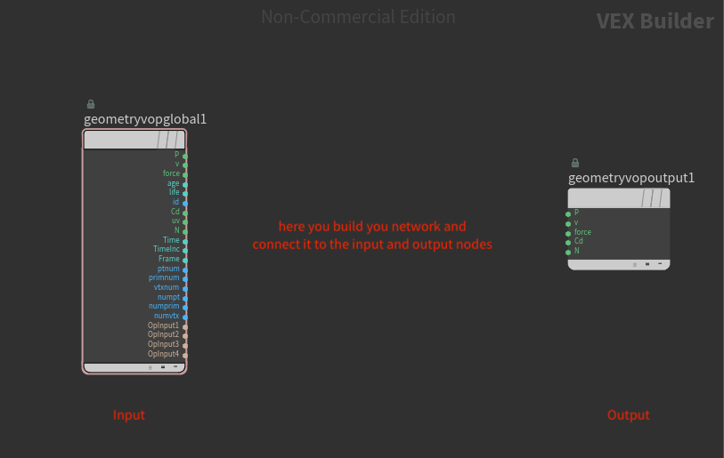
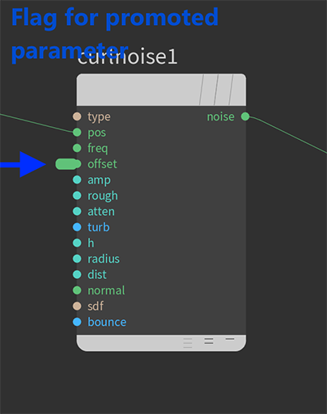

# Procedural Generation and Simulation

Prof. Dr. Lena Gieseke \| l.gieseke@filmuniversitaet.de \| Film University Babelsberg KONRAD WOLF

* [Procedural Generation and Simulation](#procedural-generation-and-simulation)
* [Tutorial 03: Noise](#tutorial-03-noise)
    * [Task 4.1 - Distributing Object Instances](#task-41---distributing-object-instances)
        * [Steps](#steps)
            * [Positioning the Template Object](#positioning-the-template-object)
    * [Task 4.2 - Animating the Normal of the Base Points](#task-42---animating-the-normal-of-the-base-points)
        * [Attribute Wrangle a.k.a. Writing Code](#attribute-wrangle-aka-writing-code)
        * [Attribute VOP a.k.a. Wiring Nodes](#attribute-vop-aka-wiring-nodes)
    * [Task 4.3 - Making it Pretty](#task-43---making-it-pretty)
        * [Submission](#submission)

# Tutorial 03: Noise

With this tutorial we leave the static worlds we have created so far behind and add time to the equation! Meaning, we animate stuff. But procedural masterminds that we are, we do not set any keyframes for that but in this specific task, we use a noise function to animate objects.  
  
Specifically, the goal of this exercise is to distribute objects along a polygon and to animate the orientation of the distributed objects with noise.
  


The steps for building the scenario of this tutorial are

* An object, you want to create multiple instances from.
* A base object to which points you copy instances to.
* Animation of the normals of the base object with noise.

I recommend to build a simple version of the scene first with e.g. a grid as base object and a rectangular box as object to create instances from. Then you can build a prettier scene from this once the core setup is working.

*Hints*

* Make sure to save often. As most 3D packages also Houdini enjoys a casual crash.
* This tutorial is intentionally a bit more open. For this please turn on your brain and understand what you are doing.

## Task 4.1 - Distributing Object Instances

In this task the goal is to distribute instances of an object based on the points of another object (e.g. a grid).


### Steps

* Inside of a geometry node create a primitive to which points you want to copy the instances to, e.g. a grid as base
    * Give the grid the `Primitive Type` `Polygon`
* As template for the instances, create a separate primitive, e.g. a small tube
    * For a correct object orientation later on, you must orient your object along the z axis!
    * You might want to re-position the template object (e.g. I moved the tube up so that the end of the tube aligns with the scene origin) as this will influence how the template object is moved. For instructions see the section below, [Positioning the Template Object](#positioning-the-template-object).
* Connect the grid base and the tube template to a `Copy to Points` node.
    * Check for the `Copy to Points` node the parameter `Pack and Instance`: This will greatly improve performance as each repeated element is a reference to the template (an instance) instead of an individual object (a copy).


#### Positioning the Template Object

How we position the template object influences the later movement of the object, as the relationship between template object and base object changes. With that it is changed how the normals of the base object transfer to the instances.

Here the version with a tube, with its middle at the scene's origin (0,0), as shown by the red marker (this is not the object's pivot!):  

  
  
  

Here the version with a tube, which is simply translated along the positive z-axis about half its height:  

  
  
  

Where to put the reference point of the template object really depends on the look you want to archive.

## Task 4.2 - Animating the Normal of the Base Points

In this task the goal is to control the normals of the base points with noise and to animate the offset of the noise.


There are two options to do this, either with an `Attribute Wrangle` or an `Attribute VOP` node. With the `Attribute Wrangle` option you write code, with the `Attribute VOP` option you connect nodes. It is up to you which way to go - feel free to test both.

### [Attribute Wrangle](https://www.sidefx.com/docs/houdini/nodes/sop/attribwrangle.html) a.k.a. Writing Code 

* Connect the wrangle node between the base grid and the copy to points node.
* Use the incoming point postion `v@P` as argument for a noise function, e.g. a [`curlnoise`](https://www.sidefx.com/docs/houdini/vex/functions/curlnoise.html) and compute a new directional vector.
* Normalize that vector (`normalize(dir)`) and assign it to the normal `v@N` of the current point.
* Create for the offset of the noise a parameter channel (`chv()`).
    * Don't forget to hit the `Create Parameter` button on the right side of the `VEXpression` code view.
* Type into the `Offset` parameter channels e.g. the `@Time` attribute to animate the offset of the noise based on the time of the timeline (this will probably need some scaling).

Please, first try to get the above steps up and running yourself - it is about two lines of code. As we have practiced this very little you might be stuck - if so, [check this code](noise_normal.vex).

### [Attribute VOP](https://www.sidefx.com/docs/houdini/nodes/sop/attribvop.html) a.k.a. Wiring Nodes

We have not worked with [Attribute VOP](https://www.sidefx.com/docs/houdini/nodes/sop/attribvop.html) nodes yet. It is basically a node in which you can dive into and there it wraps VEX commands into nodes that you can wire together.



* Connect the vop node between the base grid and the copy to points node.
* Move inside the VOP node to the `VEX Builder` level and create a noise node.
    * For this example, I personally used the [`curlnoise`](https://www.sidefx.com/docs/houdini/nodes/vop/curlnoise.html) node.
* Connect the positing channel `P` of the existing `geometryvopglobal` node to the input position channel `pos` of the noise node.
* Connect the output `noise` channel of the noise node to the input channel `N` of the existing `geometryvopouput` node.
* In order to animate the offset of the noise with the time, we need to *promote* that parameter channel as you can not animate any parameter inside of a VOP node. Promoting a parameter means to make that parameter available one level further up the network, in our case we create an `Offset` parameter for the `attribvop` node (instead of inside of it)
    * Middle-mouse click on the parameter in the node in the `VEX Builder` view (not the `Parameter` view) and select in the opened menu `Promote Parameter`.
    * Afterwards there should be a little flag next to the promoted parameter.




* Go one level up to the `Geometry` network; the `attribvop` node has a new parameter (in the `Parameter` view) `Offset`
* Type into the `Offset` parameter channels e.g. the `@Time` attribute to animate the offset of the noise based on the time of the timeline (this will probably need some scaling).


## Task 4.3 - Making it Pretty

Chose a visually pleasing setup of base object type, noise parameters, instance element design and the density of the distributing instances. Feel free to do anything you like. You could for example randomize additional properties such as the size or the coloring. Or you could use a simple tree-like [L-system](https://www.sidefx.com/docs/houdini/nodes/sop/lsystem.html) as object to create instances from.

### Submission

Submit at least one image and a gif of the animation. You do not need to render the animation but a [flipbook rendering](https://www.sidefx.com/docs/houdini/render/flipbook.html) is enough. I usually save an image sequence with the flipbook (e.g. with `pgs_ss21_tutorial_04_$F4.png` as filename for the correct frame numbering with a four digit number padding) and then create a gif out of that sequence with the command line tool [ffmpeg](https://ffmpeg.org/) with the following commands:

* Be with you terminal in the folder of you image sequence.
* First convert the image sequence to a video with

```bash
    ffmpeg -i pgs_ss21_tutorial_04_01_%04d.png  pgs_ss21_tutorial_04_01.mp4
```

* `%04d` stands for the frame padding that you have used when saving the files with the filpbook, in the above example `$F4`.
* Second, convert the video to a gif with

```bash
    ffmpeg -i pgs_ss21_tutorial_04_01.mp4  pgs_ss21_tutorial_04_01.gif
```

There is a whole article on medium about [How to create GIFs with FFmpeg](https://medium.com/@Peter_UXer/small-sized-and-beautiful-gifs-with-ffmpeg-25c5082ed733) in case you are interested in further options.

Example 1:


*Hints*

* To make my life easier, I used only one global material for everything and assigned colors to the different primitives of my instance object with a [color node](https://www.sidefx.com/docs/houdini/nodes/sop/color.html).

Example 2:


With the above setup, I was aiming for a feel of a futuristic coral rif or of a futuristic bottom of the ocean. So far, I wasn't very successful with that 🙃. But I wanted to get away from the *a nice thing in the middle of the scene setup* we have used so far. Also, I was thinking of putting the little extrusion spheres we did in the first tutorial into scene as some form of debris or fishes. But I didn't get around to that. As I said, I am not quite happy with my result as of now but you get the idea. The following steps are optional and just meant as inspiration.

I created the geometry with based on curves. First I created four curves with [curve nodes](https://www.sidefx.com/docs/houdini/nodes/sop/curve.html):


You could also just use one curve for this. If you have more than one curve, don't forget to [merge](https://www.sidefx.com/docs/houdini/nodes/sop/merge.html) them before proceeding with the next steps.

Then, I created a surface from the curves with the [skin node](https://www.sidefx.com/docs/houdini/nodes/sop/skin.html):


Next, I converted the surface with a [convert node](https://www.sidefx.com/docs/houdini/nodes/sop/convert.html) into a polygon and smoothed it a bit with a [smooth node](https://www.sidefx.com/docs/houdini/nodes/sop/smooth.html):


The above is the final surface I then copied the following objects to:


Depending on your setup, think about how it makes sense to adjust the point normals. In the above example, I used the abosolute of the noise values in order to keep the normales facing to one side of the geometry.
