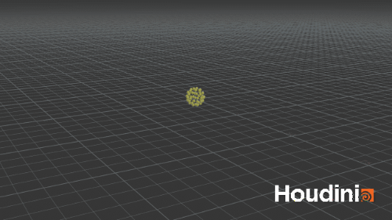

# Procedural Generation and Simulation

Prof. Dr. Lena Gieseke \| l.gieseke@filmuniversitaet.de \| Film University Babelsberg KONRAD WOLF

# Tutorial 04: Forces

The goal of this exercise is to have a very basic setup, which applies forces to objects. This represents the basis of almost all particle systems.

## Task 04.1 - Basic Force Setup

### Moving Particles

* In a geometry node scatter points on a sphere and copy another sphere to the points in order to create something like this:

* In our setup one sphere represents one particle.
* As first test, we are going to use the original position of each particle as individual force and continuously add that constant force to the position of each particle.
* For setting the initial condition of each particle, connect a `Attribute Wrangle` node to the output of the copy to points node. Call it `solver_init` and put its `Run Over` property to `Points`. With the following code we now create a global attribute and give it the position of the incoming object as value (`v` stands for vector and `@` makes it a global attribute):  

    `v@pt_force = @P;`

* For iteratively, frame by frame, executing something - in our case adding the force to the particles - we need to connect a [Solver](http://www.sidefx.com/docs/houdini/nodes/sop/solver.html) node. The solver node allows to run a SOP network (= surface operator network, which is a `Geometry` network - e.g. the one inside of a geometry node) iteratively over some input geometry. The output of the network from the previous frame serves as the input for the network at the current frame.
* To build what should be executed each frame, dive inside the solver node and connect to `Prev_Frame` an `Attribute Wrangle`, call it `particle_sim`,  put its `Run Over` property to `Points, and with code adjust the position of the incoming point by adding the point force: 
 
     `v@P += v@pt_force;`

  * Make sure to activate the attribute wrangle node (the little blue handle on the right of the node) 
  * Whenever you make changes to the solver, it might not re-compute the simulation automatically. If you want to make sure that you see the current simulation, hit the `Reset Simulation` button, which is part of the parameter UI of the solver node.

### Adding a Trail

For making the motion better visible, we add a trail to the moving particles

* Connect a [`Trail`](https://www.sidefx.com/docs/houdini/nodes/sop/trail.html) node to the output of the solver node. The trail node creates a trail for the input point over the past several frames; adjust the `Trail Length`
* To convert the trail to points only, connect a `Add` node and check `Delete Geometry but Keep the Points`
* Merge the solver output and the trail
* (In my example I connected a color node as well to color everything yellow)

### Moving the Particles II

In order to make the simulation a bit more interesting, we add to the total force a gravity force as well

* In the wrangle node `solver_init` add a `fake_gravity` vector with e.g. the values `0, -0.1, 0`
  * To have a nice stronger upwards movement in the beginning, also adjust the point force by adding `1` to its `y` value
* In the wrangle node `particle_sim` in the solver, add the `fake_gravity` to the `pt_force`

## Task 04.2 - Freestyle

Adjust the forces or add a force or any code or make any adjustments in order to make the particles move differently (make it somewhat interesting).

Example:

## References

* [Many spheres by CGWiki](http://www.tokeru.com/cgwiki/index.php?title=The_solver_sop)  
* [Solver geometry node: Houdini Documentation](http://www.sidefx.com/docs/houdini/nodes/sop/solver.html)  

