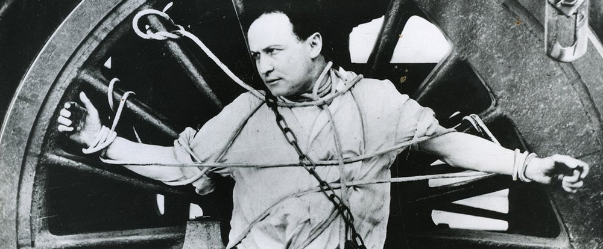
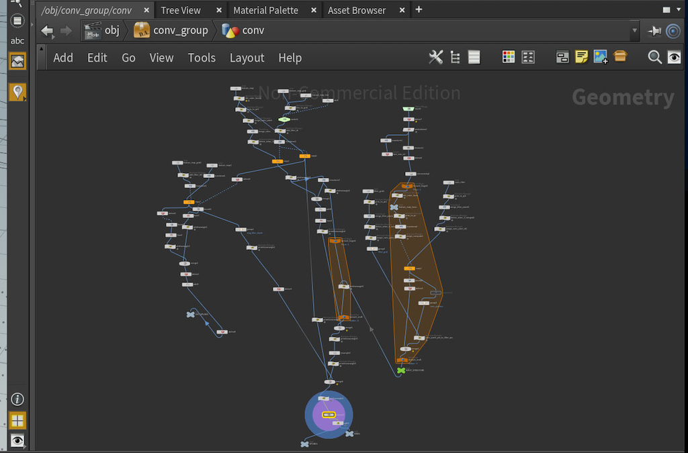
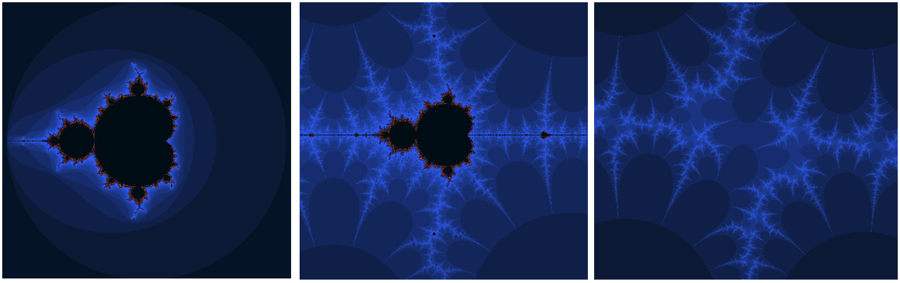

name: inverse
layout: true
class: center, middle, inverse
---

# Procedural Generation and Simulation

### Prof. Dr. Lena Gieseke | l.gieseke@filmuniversitaet.de  

#### Film University Babelsberg KONRAD WOLF

---
layout: false

## Today

--
* Re-Cap & Homework

--
* Intro Houdini

--
* Fractals

<!-- ---
## Today

TODO: Preview Image -->

---
template: inverse

# Chapter 01 - Introduction

---

# Introduction

--

* Patterns

???
.task[COMMENT:]  

* What is a pattern?
    * Repetitive structures that follow some sort of creation principles.
    * Mandelbrot: Bottomless wonders spring from simple rules, which are repeated without end.

--
* Self-Similarity

???
.task[COMMENT:]  

* What means Self-Similarity?
    * In mathematics, a self-similar object is exactly or approximately similar to a part of itself (i.e., the whole has the same shape as one or more of the parts). Many objects in the real world, such as coastlines, are statistically self-similar: parts of them show the same statistical properties at many scales.

--
* Abstractions

???
.task[COMMENT:]  

* What is an abstraction?
    * Breaking with e.g. visuals from reality
    * Abstraction came to live when artists moved away from visually representing reality in a literal fashion.
    * With the start of the last century, artists broke with visuals from reality and became more and more *non-representational*. Also, in terms of meaning artist broke free and did not aim to convey a certain, specific *subject matter* anymore. Instead, artist rely on form, color, or technique to engage the viewer on a more *intuitive* level.
--
* Procedural Generation

???
.task[COMMENT:]  

* Show homework
* Advantages
    * Compactness
        * Few kilobytes for textures and volumes
    * Continuous and multi-resolution
        * Any resolution
        * Any extent
        * E.g. for VR scenes
    * Potentially randomly accessible
        * Meaning, you can for example compute the color value for one pixel of a rasterimage independently from all other pixel in no particular order.
        * It can be evaluated in a constant time, regardless of the location of the point of evaluation, and regardless of previous evaluations.
        * Harness the power of multi-pipe GPU’s and multi-core CPU’s.
    * Parametrized
        * Often specify a whole visual category or class with controlling large amounts of details
        * Fast to interact with and flexible, e.g. in an interactive system
        * Remain editable throughout an entire visual effect production pipeline for example
* Disadvantages
    * Parametrized
        * Non-intuitive
            * Too abstract characteristics of the underlying functions (e.g. *frequency*)
            * Overlapping effects
        * Too little control
            * Surprising results can also be seen as positive
            * Almost never allow per-pixel control of the output 
        * Time-consuming exploration
    * Implementation effort
    * Limited design space
    * Potential evaluation time issues
    * Potential aliasing issues

---
.header[Inspirations]

## Patterns

* Seeing Patterns

???
.task[COMMENT:]  

* Take at least three pictures of natural patterns and at least three pictures of man-made ones (patterns can be two or three dimensional). Try to include at least one pattern with self-similarity. 

--
* Understanding and Implementing Patterns

???
.task[COMMENT:]  

* Write for one of your pattern images a generating algorithm in pseudo-code or code. Submit the code below.

--
* Seeing Faces

???
.task[COMMENT:]  

* Go through results

---
.header[Inspirations]

## Abstraction

* Abstraction in Art

???
.task[COMMENT:]  

* Chose one painting from the introduced traditional artistic styles, which is inspirational to you. Explain briefly what you like about the painting and how it might inspire you for your own work.

--
* Abstracted Artistic Expression in CGI

???
.task[COMMENT:]  

*  Chose one CG image, which you like and of which you think that it has an artistic quality to it. Explain briefly what you like about the image and why you consider it to be somewhat a pice of art. 

???
.task[COMMENT:]  

* Go through results

---
template: inverse

# Chapter 02 - Houdini

---
## Harry Houdini

--

.center[[[newrepublic]](https://newrepublic.com/article/119015/edmund-wilson-houdini)]

???
.task[COMMENT:]  

* Harry Houdini (March 24, 1874 – October 31, 1926) was a Hungarian-born American illusionist and stunt performer, noted for his sensational escape acts. [[Wiki: Harry Houdini]](https://en.wikipedia.org/wiki/Harry_Houdini)
* An old trick well done is far better than a new trick with no effect. - Harry Houdini
* Unfortunately, this friendly fella is not topic of our lecture.

---
## SideFX’s Houdini

--

.center[[[newrepublic]](https://newrepublic.com/article/119015/edmund-wilson-houdini)]

--

* Started in 1986 and the software is under active development

???
.task[COMMENT:]  

* Version of it differ greatly, be aware of that when you for example do a tutorial for it, which might be based on an older version.

--
* SideFX offers a full free version: [Houdini Apprentice](https://www.sidefx.com/products/houdini-apprentice/)

???
.task[COMMENT:]  

* Next to the fact that you are not allowed to used the free version for any commercial work, you can only render up to 1280x720 with a watermark 

--
* Comes with the Mantra renderer

???
.task[COMMENT:]  

* Explain the principle of renderers
* Mention that rendering is often not part of the tutorials
* With the free version you can not include third party renderers 

---
## SideFX’s Houdini

[.center[]](https://vimeo.com/583418040)

[2021 Houdini Film & TV Reel](https://vimeo.com/583418040)  
[2021 Houdini Games & VR Reel](https://vimeo.com/571694031)  

---
.header[Houdini]

## Why Houdini?

Introduction to a 3D offline rendering package such as Blender, Maya, 3dsMax, Cinema4D, or Houdini.

???
.task[COMMENT:]  

* Explain the different packages

---
.header[Houdini]

## Why Houdini?

--

Houdini represents the procedural generation paradigm with a node-based system.

--

.center[  [[cg.tuwien]](https://www.cg.tuwien.ac.at/courses/Visualisierung2/HallOfFame/2018/OtherTopic02/html/detail.html)]

---
.header[Houdini]

## Why Houdini?

Houdini represents the procedural generation paradigm with a node-based system.

  [[cg.tuwien]](https://www.cg.tuwien.ac.at/courses/Visualisierung2/HallOfFame/2018/OtherTopic02/html/detail.html)

* Every action is stored in a node

--
* Nodes are wired into networks

--
* Nodes can save and pass information

--
* Networks define a recipe

--
* Networks can be repeated, tweaked, etc.

---
.header[Houdini]

## Why Houdini?

Houdini represents the procedural generation paradigm with a node-based system.

--

This is a very different approach in comparison to the other 3D programs, which usually only come with a very limitedly accessible creation stack.

--

.center[  [[goskills]](https://www.goskills.com/Course/Photoshop-Basic/Lesson/196/History-States)]

---
.header[Houdini]

## Why Houdini?

Houdini supports a deep integration of Houdini and its procedural workflow within larger pipelines. 

--

For example there is a plug-in that allows the integration of Houdini technology into Unreal, etc.

--

.center[  [[cg.tuwien]](https://www.cg.tuwien.ac.at/courses/Visualisierung2/HallOfFame/2018/OtherTopic02/html/detail.html)]

---
.header[Houdini]

## Workflows

--

To adhere to a procedural workflow:

--

* Always think about your work as creating a process, rather than a thing
    * For example, don't make a table, but a procedure that builds tables and which is adaptable
--
* Avoid viewport tool interactions and input

--
* Avoid traditional box modeling workflows

--
* Avoid modeling operations that are dependent on specific point or primitive numbers

--
* Think about what needs manual art-direction and what can be left to your system to handle

--
* Changes upstream should never break the network downstream

---
.header[Houdini]

## Rendering

--

For offline render packages such as Houdini, you can chose different render engines.

--

The renderer takes the scene in Houdini and computes an image and / or different render passes from the 3D representation.

--

Houdini is shipped with the Mantra render engine.

???
.task[COMMENT:]  

* Mantra is a renderer that utilizes scanline, raytracing, and physically-based rendering. Physically based rendering (PBR) as many of you probably know, refers to the use of realistic shading/lighting models along with measured surface values in representing real-world materials accurately. Because PBR is more conceptual than it is a strict set of rules, PBR implementation systems (and results) tend to vary.

--

It also supports

* Redshift
* RenderMan
* Arnold
* OctaneRender
* V-Ray

???
.task[COMMENT:] 

* Renderman, Arnold, Mantra are a CPU-based renderer
* V-Ray, Redshift, Octane and Arnold GPU can also use the GPU for rendering

--

As we are working with the Apprentice version, we can only work with the Mantra renderer for now.

---
template:inverse

# Houdini Demo

## 👩🏽‍💻 🧑🏻‍💻 👩🏼‍💻

---
template:inverse

# Next

---
template:inverse

## Beauty in Maths

---
template:inverse

## The Mandelbrot Set

# 🤓

---
## The Mandelbrot Set

.center[]  

.center[]  
[[Wiki]](https://en.wikipedia.org/wiki/Mandelbrot_set)  

???
.task[COMMENT:]  

* https://www.skytopia.com/project/fractal/2mandelbulb.html

<!-- Board:

This happens in the world of complex numbers
Numbers of the form a + bi plotted on a complex plane
a, and b are real numbers, i^2 = -1

Mandelbrot: we have complex number c and function f_c(z) = z^2 + c
Look at the behavior of 0 under the iteration of f_c (what happens if I take 0 and plug it into the function?) and I keep doing that to the result

f_1(z) = z^2 + 1

f_1(0) = 0^2 + 1 -> 1
f_1(1) = 1^2 + 1 -> 2
f_1(2) = 2^2 + 1 -> 5
f_1(5) = 5^2 + 1 -> 26

What happens to the size of the result? The magnitude (the distances of a and b on the plane). Do they blow up or stay bounded?

The above is the “blowing up” case

The bounded case, e.g. happens for c = -1

f_-1(0) = 0^2 + -1 -> -1
f_-1(-1) = -1^2 + -1 -> 0
f_-1(0) = 0^2 + -1 -> -1

The Mandelbrot set defines only numbers that are bounded (never larger than 2)

For the pretty pictures you color complex number on the complex plane depending in this behavior

The boundaries are where it gets interesting: when you move c a little you can’t predict what happens

https://www.youtube.com/watch?v=NGMRB4O922I -->

---
.header[Next]

## Beauty in Maths

Next, we will start to generate some pretty results just with numbers and simple formulas.

--

.center[]

--

Fear not, it is going to be fun!

---
template:inverse

### The End

# 👋🏻
