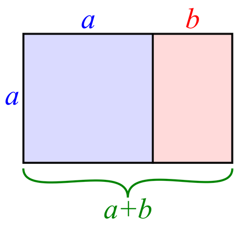
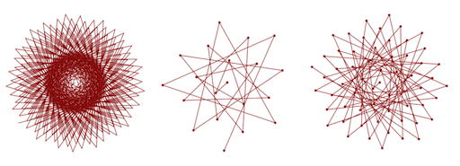
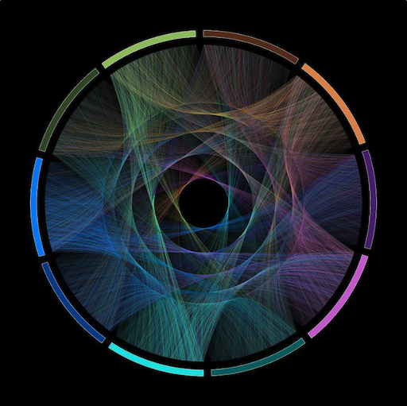
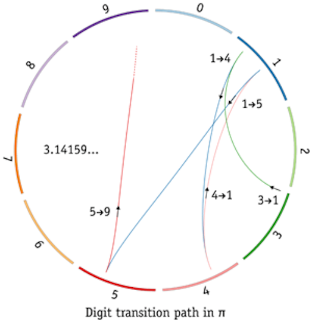
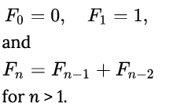
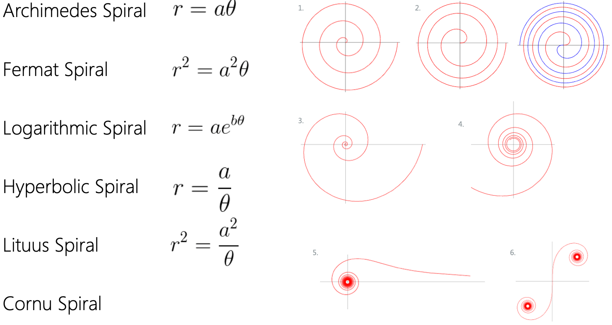
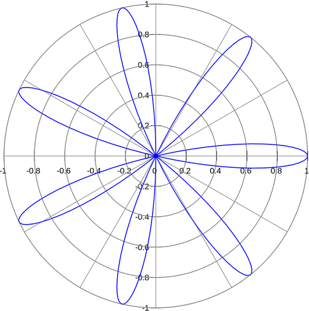
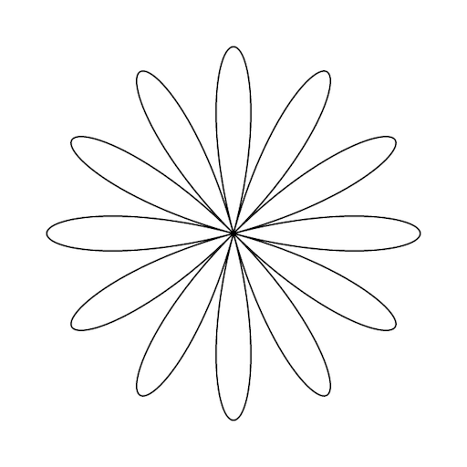
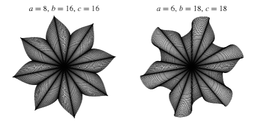

name: inverse
layout: true
class: center, middle, inverse
---


# Procedural Generation and Simulation

### Prof. Dr. Lena Gieseke | l.gieseke@filmuniversitaet.de  

#### Film University Babelsberg KONRAD WOLF


---
layout: false

## Today

--
* Re-Cap & Homework

--
* Mandelbrot

--
* Beautiful Numbers

--
* Beautiful Curves


<!-- ---
## Today

TODO: Preview Image -->


---
template: inverse

# Chapter 02 - Houdini

---
.header[Houdini]

## Why Houdini?

Introduction to a 3D offline rendering package such as Maya, 3dsMax, Cinema4D, or Houdini.

--

Houdini represents the procedural generation paradigm with a node-based system:

* Every action is stored in a node
* Nodes are wired into networks
* Nodes can save and pass information
* Networks define a recipe
* Networks can be repeated, tweaked, etc.

--

This is a very different approach in comparison to the other 3D programs, which usually only come with a very limitedly accessible creation stack.

---
.header[Houdini]

## Workflows

To adhere to a procedural workflow:

--

* Always think about your work as creating a process, rather than a thing
    * For example, don't make a table, but a procedure that builds tables and which is adaptable
--
* Avoid viewport tool interactions and input

--
* Avoid traditional box modeling workflows

--
* Avoid modeling operations that are dependent on specific point or primitive numbers

--
* Think about what needs manual art-direction and what can be left to your system to handle

--
* Changes upstream should never break the network downstream

---
.header[Houdini]

## Rendering

For offline render packages such as Houdini, you can chose different render engines.

--

The renderer takes the scene in Houdini and computes an image and / or different render passes from the 3D representation.

--

Houdini is shipped with the Mantra render engine.


???
.task[COMMENT:]  

* Mantra is a renderer that utilizes scanline, raytracing, and physically-based rendering. Physically based rendering (PBR) as many of you probably know, refers to the use of realistic shading/lighting models along with measured surface values in representing real-world materials accurately. Because PBR is more conceptual than it is a strict set of rules, PBR implementation systems (and results) tend to vary.

--

It also supports

* RenderMan
* Arnold
* OctaneRender
* Redshift
* V-Ray

???
.task[COMMENT:] 

* Renderman, Arnold, Mantra are a CPU-based renderer
* V-Ray, Redshift, Octane and Arnold GPU can also use the GPU for rendering

--

In this class we will only use Mantra.

---
template: inverse

## Mandelbrot


???
.task[COMMENT:]  

* Go to board

---
## VEX

--
* Small and efficient general purpose language for writing shaders and custom nodes in Houdini

--
* Loosely based on the C land C++ as well as the RenderMan shading language

--

http://www.sidefx.com/docs/houdini/vex/  
http://www.sidefx.com/docs/houdini/vex/lang.html  
http://www.sidefx.com/docs/houdini/vex/snippets.html  

---
## VEX

* Several nodes in Houdini let you write short VEX expressions or snippets of VEX code 
    * Attribute Wrangle geometry node 
        * Runs a VEX snippet to modify attribute values. 
    * Point Wrangle geometry node 
        * Runs a VEX snippet to modify point attributes, including position. 


???
.task[COMMENT:]  

* https://www.skytopia.com/project/fractal/2mandelbulb.html
  


---
template: inverse

# Chapter 03 - Beauty in Maths

---
template:inverse

# $e^{i\pi} + 1 = 0$


???
.task[COMMENT:]  

where

* $e$ is Euler's number, the base of natural logarithms,
* $i$ is the imaginary unit, which by definition satisfies $i^{2} = −1$, and
* $\pi$ is pi, the ratio of the circumference of a circle to its diameter.

---
## Euler's Identity

The formula is considered to be an exemplar of vast mathematical beauty.


???
.task[COMMENT:]  

* Its beauty arises from its simplicity while expressing highly complex behavior and its profound connection between the most fundamental numbers in mathematics.

--

Stanford University mathematics professor Keith Devlin has said,  

> ...like a Shakespearean sonnet that captures the very essence of love, or a painting that brings out the beauty of the human form that is far more than just skin deep, Euler's equation reaches down into the very depths of existence. [4] 

--

Beauty *on a mathematical level* is *not* our topic but..

--
*visual representations and characteristics* of numbers and equations.

---
template: inverse

# Golden Ratios


???
.task[COMMENT:]  

* What is the golden ratio?

---
## The Golden Ratio

We have a *golden* ratio if the ratio of two quantities is the same as the ratio of their sum to the larger of the two quantities.

$\frac{a+b}{a} = \frac{a}{b}$

???
.task[COMMENT:]  

* A ratio describes one quantity in relationship to another one, e.g. how long the width of an image is in relationship to its height. 

--

Line segments in the golden ratio:

  
[[wiki]](https://en.wikipedia.org/wiki/Golden_ratio)

---
## The Golden Rectangle

  
[[wiki]](https://en.wikipedia.org/wiki/Golden_ratio)


???
.task[COMMENT:]  

* Whether this is a *beautiful* ratio or not is up to personal taste. Be careful though to believe the widespread understanding that the golden ratio is the *natural blueprint* for beauty. There is very little *scientific* evidence for that. You can find ratios similar to the golden ratio in the world, such as in human faces, the Parthenon, etc. but the emphasis is on *similar* and also there are various other prominent ratios out there. With the golden ratio we might have a case of *you find what you are looking for*.

---
## The Golden Rectangle

.center[]


---
## The Golden Ratio

This ratio is defined as $\varphi$:

$\frac{a+b}{a} = \frac{a}{b} \stackrel{\mathrm{def}}{=} \varphi$


???
.task[COMMENT:]  

* $\varphi$ is a very special number - why?

--

One of the special properties of the Golden Ratio is that *it can be defined in terms of itself*, as shown above. 

--


$1+\frac{1}{\varphi}=\varphi$

---
## The Golden Ratio

This leads to a *continued fraction*, which just can't be expressed as a regular fraction not matter what.

$1+{\cfrac {1}{1+{\cfrac {1}{1+{\cfrac {1}{1+{\cfrac {1}{1+\ddots }}}}}}}}$

--

A number which can not be constructed from ratios (or fractions) of integers is an *irrational number*. Their decimal expansions neither terminate nor become periodic.

  
  
[[Maths is Fun]](https://www.mathsisfun.com/irrational-numbers.html)

---
## The Golden Ratio

You can solve $\varphi$ algebraically to 

--

$\frac{1+{\sqrt{5}}}{2} = 1.618\,033\,988\,7\dots$  
  

???
.task[COMMENT:]  

* Because $\varphi$ is the ratio between positive quantities, $\varphi$ is necessarily positive:

---
## The Golden Ratio

In summary:

|                    |                                  $\varphi$                                  |
|--------------------|:---------------------------------------------------------------------------:|
| Decimal            |                          1.6180339887498948482...                           |
| Continued fraction | $1+{\cfrac {1}{1+{\cfrac {1}{1+{\cfrac {1}{1+{\cfrac {1}{1+\ddots }}}}}}}}$ |
| Algebraic form     |                          $\frac{1+{\sqrt{5}}}{2}$                           |


???
.task[COMMENT:]  

* You can find $\varphi$ everywhere in nature - mathematically

---
## $\varphi$ in Nature


???
.task[COMMENT:]  

* Imagine you are a plant and you can spread leaves all around your stem. Now, being a plant, needing Photosynthese and such, you want all of your leafes to soak up as much sun (and rain) as possible. So when you sprout a new leaf, you don’t want it to block your other leaves.

--
.center[[[gofiguremath]](http://gofiguremath.org/natures-favorite-math/the-golden-ratio/the-golden-angle/)]

---
## $\varphi$ in Nature


.center[[[gofiguremath]](http://gofiguremath.org/natures-favorite-math/the-golden-ratio/the-golden-angle/)]


???
.task[COMMENT:]  

* What you want is to turn for every new leave a certain degree as the following (the numbers indicate the order in which the leaves grew).

---
## $\varphi$ in Nature

.center[  [[gofiguremath]](http://gofiguremath.org/natures-favorite-math/the-golden-ratio/the-golden-angle/)]


???
.task[COMMENT:]  

* The same problem applies if you imagine to be a sunflower and you want to pack as many seeds as possible, while all of them getting as much sun as possible.

---
## Golden Angle

The flowers are making a turn to grow a new leaf or place a new seed with the *golden angle*.

.center[  [[gofiguremath]](http://gofiguremath.org/natures-favorite-math/the-golden-ratio/the-golden-angle/)]


???
.task[COMMENT:]  

* In geometry, the golden angle is the smaller of the two angles created by sectioning the circumference of a circle according to the golden ratio; that is, into two arcs such that the ratio of the length of the smaller arc to the length of the larger arc is the same as the ratio of the length of the larger arc to the full circumference of the circle: [[23]](https://en.wikipedia.org/wiki/Golden_angle)

---
## Golden Angle


The best solution to *how far to turn from the last leaf* in degree is therefore $~137.5°$, and that is what all kinds of plants do:


.center[  ]  
.center[[[LeerZelfBeleggen]](https://leerzelfbeleggen.com/wp-content/uploads/2018/08/Fibonacci-trading-leren-traden-met-de-geheime-formule-voorbeelden.jpeg)]

---
## Golden Angle

Such an arrangement of leaves, which applies the golden angle, is also called *phyllotaxis* (*leaf arrangement* in Greek) in botany. 

--

There is a simple algorithm for it by Helmut Vogel.

--

[.center[]](https://editor.p5js.org/legie/sketches/iVLdC_coE)


???
.task[COMMENT:]  

* https://editor.p5js.org/legie/sketches/iVLdC_coE
* If we change the angle from the golden angle to an arbitrary angle between 0..360 we get vastly different designs for only very small changes. The following code maps the angle to turn to the mouse position in x. Try the code for yourself!

---
.header[Golden Angle]

## Phyllotaxis

.center[]


???
.task[COMMENT:]  

* Fractions for the `ratio` value lead to spikes, while getting closer to an irrational number produces dense distributions:
* https://editor.p5js.org/legie/sketches/iVLdC_coE


---
.header[Golden Angle]

## Phyllotaxis


???
.task[COMMENT:]  

* What to do with this? Well, now it is up to being creative. Just connecting the element by lines already give interesting designs:

--
.center[    ]  
.center[[[codeproject]](https://www.codeproject.com/Articles/1221341/The-Vogel-Spiral-Phenomenon)]


???
.task[COMMENT:]  

* Of course forumlas such as the phyllotaxis one above have been used over and over,... and over again. We have seen these visuals. That doesn't mean that there aren't plenty of options left to work with these fascinating structures. What I am trying to say is that by just simply plotting the base examples, you will not get a creativity medal. You will have to really think about a visualization / application to make them interesting anew.

---
## Famous Irrational Numbers

* $\varphi = 1.61803398874989484820...$
    * The most irrational of them all  
--
* $\pi = 3.1415926535897932384626433832795..$
    * The rockstar of the irrational numbers
    * The popular approximation of $\frac{22}{7} = 3.1428571428571$ is close but not accurate
    * Over a quadrillion decimal places have been calculated and *still there is no pattern!!!*
--
* $e = 2.7182818284590452353602874713527$
    * Euler's Number
    * Base of the Natural Logarithms

???
.task[COMMENT:]  

* Many square roots, cube roots, etc. are also irrational numbers.
    * $\sqrt{3} = 1.7320508075688772935274463415059...$
    * $\sqrt{99} = 9.9498743710661995473447982100121...$
    * But e.g. $\sqrt{4} = 2$ (rational), and $\sqrt{9} = 3$ (rational), so not all roots are irrational.

---
## $\pi$

$\pi = 3.14159 26535 89793 23846 26433 83279 50288 41971 ...$

???
.task[COMMENT:]  

* $\pi$ is a real crowd-pleaser. Why is that?

--

$\pi$ appears in formulae for areas and volumes of geometrical shapes based on circles, such as ellipses, spheres, cones, and tori. Below are some of the more common formulae that involve $\pi$.

--

.left-even[  
[[wiki]](https://en.wikipedia.org/wiki/Pi#/media/File:Pi_eq_C_over_d.svg)]

.right-even[
With radius r 

* is the circumference $2\pi r$.
* is the area of a circle $\pi r^2$.
* is the volume $\frac{4}{3}\pi r^3$
* is the surface area $4\pi r^2$.
]


???
.task[COMMENT:]  

* $\pi$ appears in many, many other formulas in all areas of mathematics and physics.  
* Its omnipresence and usefulness plays a big role for $\pi$'s popularity. But its inherent characteristic are also truly captivating.

---
## $\pi$

.center[  
[[sas blogs]](https://blogs.sas.com/content/iml/2015/03/12/digits-of-pi.html#prettyPhoto)]


???
.task[COMMENT:]  

* The digits of $\pi$ are uniformly randomly distributed, meaning that its digits 0 through 9 appear equally often, as do pairs of digits, trios of digits, and so forth. If you don't believe it you can count digits in its first [10 million decimal places](https://introcs.cs.princeton.edu/java/data/pi-10million.txt).
* The digits of $\pi$ pass every test for randomness, yet $\pi$ is a precise mathematical value that describes the relationship between the circumference of a circle and its diameter. This dichotomy between *very random* and *very structured* blows my mind. [[20]](https://blogs.sas.com/content/iml/2015/03/12/digits-of-pi.html#prettyPhoto)

---
## $\pi$

.center[  
[[fineartamerica]](https://fineartamerica.com/featured/flow-of-life-flow-of-pi-cristian-ilies-vasile.html)]


???
.task[COMMENT:]  

* In honor of $\pi$ day, which is on March, 14th according to the north american date formating of 03.14., several artists visually represent $\pi$ each year anew in a creative and beautiful manner.
* http://mkweb.bcgsc.ca/
* Here, the digits of $\pi$ are represented as a path traced by links between successive digits. Each digit is assigned a segment around the circle and a link between segment $i$ and $j$ corresponds to the appearance of $ij$ in $\pi$. For example, the $14$ in $3.14...$ is drawn as a link between segment $1$ and segment $4$. [[21]](http://mkweb.bcgsc.ca/pi/art/method.mhtml)

  
[[mkweb]](http://mkweb.bcgsc.ca/pi/art/method.mhtml)

As more digits are added to the path, the image becomes a weaving mandala.


---
template:inverse

## $0, 1, 1, 2, 3, 5, 8, 13, 21, 34, 55, 89, 144, ...$


???
.task[COMMENT:]  

* Do you recognize the following sequence of numbers? How is the sequence constructed?
* Fibonacci Sequence

---
## Fibonacci Sequence

Each number is the sum of the two preceding ones, starting from $0$ and $1$. That is, 


???
.task[COMMENT:]  

* In mathematics, the Fibonacci numbers, commonly denoted $F_n$, form a sequence, called the Fibonacci sequence, such that each number is the sum of the two preceding ones, starting from $0$ and $1$. That is, 

--



--


???
.task[COMMENT:]  

* Knowledge of the Fibonacci sequence was expressed from the Indian mathematician [Acharya Pingala](https://en.wikipedia.org/wiki/Pingala) in connection with a study of poetic metres and verse in Sanskrit as early c. 450 BC–200 BC. Outside India, the Fibonacci sequence first appears in the book [Liber Abaci](https://en.wikipedia.org/wiki/Liber_Abaci) (1202) by [Fibonacci](https://en.wikipedia.org/wiki/Fibonacci) using it to calculate the growth of rabbit populations. [7][8][9][10]

---
## Fibonacci Sequence

???
.task[COMMENT:]  

* There is a special relationship between the Golden Ratio and Fibonacci Numbers in that the ratio of two successive Fibonacci numbers is close to the golden ratio:

--

.center[[[hydrogen2oxygen]](https://hydrogen2oxygen.net/en/2012/06/21/the-fibonacci-sequence-is-the-mathematical-first-cousin-of-the-golden-ratio/)]

---
## Fibonacci Sequence

Geometrically the Fibonacci Sequence can be expressed as follows.

.center[[[wiki]](https://commons.wikimedia.org/wiki/File:34*21-FibonacciBlocks.png)]

---
## Fibonacci Sequence

The above segmentation of an rectangle approximates the *golden spiral*. 

.center[[[wiki]](https://commons.wikimedia.org/wiki/File:34*21-FibonacciBlocks.png)]


???
.task[COMMENT:]  

* But wait. What is a *spiral* and why is it *golden*? Don't we need $\varphi$ for anything to be golden?

---
## Golden Spiral

The special value for the growth factor $b$ is based on $\varphi$, the golden ratio. The golden spiral gets wider (or further from its origin) by a factor of $\varphi$ for every quarter turn it makes.

.center[[[wiki]](https://commons.wikimedia.org/wiki/File:FakeRealLogSpiral.svg)]


---
## Golden Spiral

.center[[[wiki]](https://commons.wikimedia.org/wiki/File:GoldenSpiralLogarithmic_color_in.gif)]


???
.task[COMMENT:]  

* Golden spirals are self-similar. The shape is infinitely repeated when magnified.

---
template:inverse

# Curves


???
.task[COMMENT:]  

* Next to spirals as curve designs, there are several similarly simple functions that create aesthetically pleasing curves. At first sight, the Wikipedia and Wolfram pages of these functions can appear a bit intimidating. But I would like to show you that it is actually not that hard to get a grip on these functions.

Let's have a look into the rose curve.

---
## Spirals

.center[]

---
## The Rose Curve

--

.center[[[wiki]](https://en.wikipedia.org/wiki/Rose_\(mathematics\))]

---
## The Rose Curve

What does [wiki](https://www.wikiwand.com/en/Rose_\(mathematics\)) say?

What does [Wolfram](https://mathworld.wolfram.com/RoseCurve.html) say?


???
.task[COMMENT:]  

* This page is still somewhat simple and well-arranged. Sometimes these pages overflow with explanations, different representations, history and proofs, etc.. Fear not! What you always want to look out for is the *coordinates* you can plot, be it polar or cartesian coordinates (we know how to go from one to the other so it does not really matter what we get).

--

Rose curves are defined by (as cartesian parametric equations)

$x=r \cos(k\theta )\cos(\theta )$  
$y=r \cos(k\theta )\sin(\theta )$  

for various $k = n / d$.


???
.task[COMMENT:]  

* For the rose curve, the parametric equations are right under *General overview* ready for us to use (how convenient!):

--

*Let's work with that...*  

---
.header[The Rose Curve]

## Parameter r

For simplicity you can always start with assuming a radius of 1, giving us

--

$x=\cos(k\theta )\cos(\theta )$  
$y=\cos(k\theta )\sin(\theta )$  

---
.header[The Rose Curve]

## Parameter Theta

$\theta$ is an angular coordinate:

  
[[wolfram]](https://mathworld.wolfram.com/PolarAngle.html)  


???
.task[COMMENT:]  

* or polar angle if we are in polar coordinates


---
.header[The Rose Curve]

## Parameter Theta

.center[[[wikimedia]](https://commons.wikimedia.org/wiki/File:7_Petal_rose.svg)]


???
.task[COMMENT:]  

* What do we have to do to draw this?

--
In order to draw the whole rose, we need to iterate $\theta$ over the circumference of a circle, hence $2\pi$ in radians or $360^\circ$ in degree

---
## The Rose Curve

```js
    // The usual p5 setup code

    // ...

    function draw()
    {
        background(255);

        // Moving whatever we are drawing to the center
        // of the canvas to have the center as origin
        translate(width * 0.5, height * 0.5);

        // Defining r in reference to the canvas size
        let r = width * 0.4;

        beginShape();
        for (let theta = 0; theta < TWO_PI; theta+= 0.01)
        {
            let x = ...
            let y = ...
            vertex(x, y);
        }

        endShape(CLOSE);
    }
```


???
.task[COMMENT:]  

* Therefore, a code basis for drawing the rose in p5 could look as follows (feel free to follow along with the code in p5)


---
## The Rose Curve


```js
    // ...

    function draw()
    {
        background(255);
        translate(width * 0.5, height * 0.5);

        let r = width * 0.4;
        //2k petals if k is even, and
        //k petals if k is odd
        let k = 6;

        beginShape();
        for (let theta = 0; theta < TWO_PI; theta+= 0.01)
        {
            let x = r * (cos(k*theta) * cos(theta));
            let y = r * (cos(k*theta) * sin(theta));
            vertex(x, y);
        }

        endShape(CLOSE);
    }
```


???
.task[COMMENT:]  

* https://editor.p5js.org/legie/sketches/p7nFMtCEa
* Version 1

---
.header[The Rose Curve]

## Parameter k

Wiki also gives us some more information about $k$.

--

If k is an integer, the curve will be rose-shaped with

* 2k petals if k is even, and
* k petals if k is odd.


???
.task[COMMENT:]  

* Nice, we want that controllability for our rose, so let's add that to the code and compute the (cartesian) coordinates. All code snippets here are optimized for readability and understanding - some things could be implemented more efficiently, e.g. computing `cos(k*theta)` twice...


---
## The Rose Curve




???
.task[COMMENT:]  

* Let's map k to the with position of the mouse to explore the design space:

```js
let k = floor(map(mouseX, 0, width, 1, 20));
```

* But *wait*, you will say. *Why don't we see all the designs from the wiki preview image*?


---
## The Rose Curve

It is actually not just $k$ used but $k = \frac{n}{d}$.

---
## The Rose Curve

```js
    function draw()
    {
        background(255);
        translate(width * 0.5, height * 0.5);

        let r = width * 0.4;
        let n = floor(map(mouseX, 0, width, 1, 10));
        let d = floor(map(mouseY, 0, height, 1, 10));  
        let k = n / d;

        beginShape();
        for (let theta = 0; theta < TWO_PI; theta+= 0.01)
        {
            let x = r * (cos(k*theta) * cos(theta));
            let y = r * (cos(k*theta) * sin(theta));
            vertex(x, y);
        }
        endShape(CLOSE);
    }
```


???
.task[COMMENT:]  

* https://editor.p5js.org/legie/sketches/p7nFMtCEa
* Version 1
* What is now the problem?

---
.header[The Rose Curve]

## Number of Loops

Well, if we skim the wiki page, there is an animation that gives us an intuition that we need $\theta$ to go around a circle more than once, meaning we need more *loops*, to draw the whole shape.

.center[ [[wiki]](https://commons.wikimedia.org/wiki/File:Rose_Curve_animation_with_Gears_n4_d5.gif)]


???
.task[COMMENT:]  

* But wiki is not really clear about how many loops we need. Now we have two options: 1. read the wiki page in detail to gain a better understanding or 2. find another resource which gives us the infos we are looking for more directly. As I am lazy, I go for option 2 and my second place to look at for maths is usually Wolfram.

And, we are successful! [Wolfram](https://mathworld.wolfram.com/Rose.html) says on first sight something about *closing the curve*: 

> If $n=r/s$ is a rational number, then the curve closes at a polar angle of $\theta=\pi s p$, where $p=1$ if $rs$ is odd and $p=2$ if rs is even.

Unfortunately, and this happens usually when you use multiple resources, the parameter are named differently. But, we can easily translate them by setting n = k, r = n, s = d

---
.header[The Rose Curve]

## Number of Loops

> If k = n / d is a rational number, then the curve closes at a polar angle of  $\theta=\pi d p$, where $p=1$ if $nd$ is odd and $p = 2$ if $nd$ is even.

--

Meaning, we need $\theta=2d\pi$ loops!

```js
...

for (let theta = 0; theta < TWO_PI * d; theta+= 0.01)
{
    ...
}
...
```


???
.task[COMMENT:]  

* Now, have fun exploring the design space. If you couldn't follow the above explanation, feel free to ask [Dan](https://www.youtube.com/watch?v=f5QBExMNB1I).

---
## The Maurer Rose

--


  
[[wolfram]](https://mathworld.wolfram.com/MaurerRose.html)  

--
  
[[wolfram]](https://mathworld.wolfram.com/MaurerRose.html)  


???
.task[COMMENT:]  

* E.g. the [maurer rose](https://en.wikipedia.org/wiki/Maurer_rose) and the [starr rose](https://mathworld.wolfram.com/StarrRose.html) are versions of the basic rose algorithm (even though the starr rose will take some more figuring out...)

---
## The Heart Curve

--

.center[ [[wolfram]](https://mathworld.wolfram.com/HeartCurve.html)]


???
.task[COMMENT:]  

* If you feel adventourus, for example implement the heart curve: [wiki](https://en.wikipedia.org/wiki/Heart_symbol#Parametrisation), [wolfram](https://mathworld.wolfram.com/HeartCurve.html), [shiffman](https://www.youtube.com/watch?v=oUBAi9xQ2X4)


---
template:inverse

## Next

---
.header[Next]

##  Function Design

Next we are going to have a look into how to design and put together functions ourselves.

.center[ [[webcomicms]](https://webcomicms.net/clipart-9428627-math-related-pictures)]


---
template:inverse

### The End

# 👋🏻
