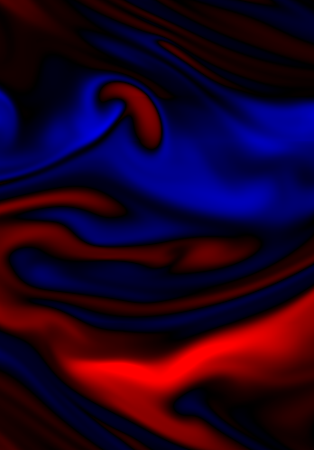

name: inverse
layout: true
class: center, middle, inverse
---

# Procedural Generation and Simulation

### Prof. Dr. Lena Gieseke | l.gieseke@filmuniversitaet.de  

#### Film University Babelsberg KONRAD WOLF

---
layout: false

## Today

* Recap of previous chapter 
* Homework

--
* Fluids

--
    * Properties
    * Formula
    * Real-time simulation

---
## Today

---
template:inverse

### Chapter 9

# Fluid Simulation

---
## Fluids

.center[]  
[[factspage]](https://factspage.blogspot.com/2013/12/what-is-fluid.html)

---
## Fluids

.center[]  
[[organiclifestylemagazine]](https://www.organiclifestylemagazine.com/is-your-honey-actually-honey)

---
## Fluids

.center[]  
[[wiki]](https://www.wikiwand.com/en/Gas)

???
.task[COMMENT:]  

* 21 April 1990 eruption of Mount Redoubt, Alaska, illustrating real gases not in thermodynamic equilibrium. 

---
## Fluids

.center[]  
[[wiki]](https://www.wikiwand.com/en/Gas)

???
.task[COMMENT:]  

* Satellite view of weather pattern in vicinity of Robinson Crusoe Islands on 15 September 1999, shows a turbulent cloud pattern called a Kármán vortex street

---
## Fluids

.center[]  
[[wiki]](https://www.wikiwand.com/en/Gas)

---
## Fluids

.center[]  
[[freep]](https://eu.freep.com/story/news/local/michigan/2019/02/08/blue-ice-great-lakes-michigan/2780668002/)

  
---
## Fluids

--

* Liquid
* Gas
* Any material that continuously deforms, e.g. ice

--

The main defining physical properties are

--
* a lack of resistance to permanent deformation,

???
.task[COMMENT:]  

* resisting only relative rates of deformation in a dissipative, frictional manner, and

--
* the ability to flow (also described as the ability to take on the shape of the container).

.footnote[[[wiki]](https://www.wikiwand.com/en/Fluid)]

???
.task[COMMENT:]  

* In physics, a fluid is a liquid, gas, or other material that continuously deforms (flows) under an applied shear stress, or external force.[1] They have zero shear modulus, or, in simpler terms, are substances which cannot resist any shear force applied to them. 

---
## Fluids

In physics, fluids are usually represented as particle systems.

.center[]  
[[ttnghia]](https://ttnghia.github.io/posts/fluid-simulation-2d/)

???
.task[COMMENT:]  

* https://ttnghia.github.io/posts/fluid-simulation-2d/
* Liquid particles, e.g. pile to the ground where as gas particles would take up the whole space of the container.

---
## Fluids

In physics, fluids are usually represented as particle systems.

.center[]  
[[falstad]](https://www.falstad.com/gas/)

???
.task[COMMENT:]  

* https://www.falstad.com/gas/
* Liquid particles, e.g. pile to the ground where as gas particles would take up the whole space of the container.
* Fluids can mix with other fluids

---
## Fluids' Properties

--
* Density
    * Mass per volume

.footnote[[The following list is based on: [Understanding liquids for dynamic simulations - Houdini 18]](https://www.youtube.com/watch?v=fcJSG2ooh1M)]

---
## Fluids' Properties

* Density
    * Mass per volume
* Viscosity
    * Resistance to deformation

.center[]  
[[wiki]](https://www.wikiwand.com/en/Viscosity)

---
## Fluids' Properties

* Density
    * Mass per volume
* Viscosity
    * Resistance to deformation
* Temperature
    * Aggregation states
???
.task[COMMENT:]  

* Water, e.g., ice, water, gas

--
* Cohesion and adhesion
    * Surface attraction

.center[]  
[[wiki]](https://www.wikiwand.com/en/Cohesion_(chemistry))

---
## Fluids' Properties

* Density
    * Mass per volume
* Viscosity
    * Resistance to deformation
* Temperature
    * Aggregation states
* Cohesion and adhesion
    * Surface attraction

.center[]  
[[quora]](https://www.quora.com/What-is-cohesion-adhesion-in-fluid-mechanics?redirected_qid=22078838)

---
## Fluids' Properties

* Density
    * Mass per volume
* Viscosity
    * Resistance to deformation
* Temperature
    * Aggregation states
* Cohesion and adhesion
    * Surface attraction
* Surface tension

.center[]  
[[scienceabc]](https://www.scienceabc.com/pure-sciences/what-is-surface-tension-definition-causes-examples.html)

???
.task[COMMENT:]  

* simply put, surface tension is the tendency of molecules of a liquid to be attracted more towards one another at the surface of a liquid than to the air above it.

---
## Fluids' Properties

* Density
    * Mass per volume
* Viscosity
    * Resistance to deformation
* Temperature
    * Aggregation states
* Cohesion and adhesion
    * Surface attraction
* Surface tension
* Color
* Transparency

---
.header[Fluids' Properties]

## Example - Water

.center[  
[[VoxelFX]](https://www.youtube.com/watch?v=fcJSG2ooh1M)]  

---
.header[Fluids' Properties]

## Example - Water

.center[  
[[VoxelFX]](https://www.youtube.com/watch?v=fcJSG2ooh1M)]  

---
template:inverse

## Navier-Stokes Equations

---
.header[Fluid Simulation]

## Navier-Stokes Equations

Mathematical model for describing dynamic motion of incompressible fluids.

--

> How fluids flow...

???
.task[COMMENT:]  

* This equation can model any fluid
* A fluid changes shape to match the container it is contained in
* https://www.ibiblio.org/e-notes/webgl/gpu/fluid.htm

--

.center[]  
[[Created with Wind Tunnel/Quanta Magazine]](https://www.quantamagazine.org/what-makes-the-hardest-equations-in-physics-so-difficult-20180116/)

---
.header[Fluid Simulation]

## Navier-Stokes Equations

Based on

--
1. Conversation of mass

???
.task[COMMENT:]  

* The incompressibility of the fluid

--

.center[] 

???
.task[COMMENT:]  

* v as speed with a direction
* Nabla is a gradient, a derivative -> do differentiate
    * Change in x, change in y, change in z
* The equal zero tells us that mass is convered

---
.header[Fluid Simulation]

## Navier-Stokes Equations

Based on

1. Conversation of mass
2. Conversation of momentum
  
--
  
Newton's 2nd law of motion:

.center[] 

---
.header[Fluid Simulation]

## Navier-Stokes Equations

.center[] 

.footnote[[[Quanta Magazine - What Makes the Hardest Equations in Physics So Difficult?]](https://www.quantamagazine.org/what-makes-the-hardest-equations-in-physics-so-difficult-20180116/)]

---
.header[Fluid Simulation]

## Navier-Stokes Equations

.center[] 

.footnote[[[Quanta Magazine - What Makes the Hardest Equations in Physics So Difficult?]](https://www.quantamagazine.org/what-makes-the-hardest-equations-in-physics-so-difficult-20180116/)]

???
.task[COMMENT:]  

* Mass is here a density, they are the same thing when it comes to fluids

---
.header[Fluid Simulation]

## Navier-Stokes Equations

.center[] 

.footnote[[[Quanta Magazine - What Makes the Hardest Equations in Physics So Difficult?]](https://www.quantamagazine.org/what-makes-the-hardest-equations-in-physics-so-difficult-20180116/)]

---
.header[Fluid Simulation]

## Navier-Stokes Equations

.center[] 

.footnote[[[Quanta Magazine - What Makes the Hardest Equations in Physics So Difficult?]](https://www.quantamagazine.org/what-makes-the-hardest-equations-in-physics-so-difficult-20180116/)]

???
.task[COMMENT:]  

* The first two terms: the internal forces, force between the internal particles
    * P is the change in pressure, fluids have the tendency to flow from high pressure areas to low pressure areas.
    * the middle term is viscosity, a higher the values the higher the friction between the fluid's particles (air vs. honey)

---
.header[Fluid Simulation]

## Navier-Stokes Equations

.center[] 

.footnote[[[Quanta Magazine - What Makes the Hardest Equations in Physics So Difficult?]](https://www.quantamagazine.org/what-makes-the-hardest-equations-in-physics-so-difficult-20180116/)]

???
.task[COMMENT:]  

* F are the external forces
    * Gravity
    * Walls
    * Wind

---
.header[Fluid Simulation]

## Navier-Stokes Equations

  
#### 1. Conversation of mass:  
  
  
  
#### 2. Conversation of momentum:   
   

???
.task[COMMENT:]  

* A time derivative of velocity is acceleration
* rho is the density, hence we have mass times acceleration
* The right side is pretty much the sum of various forces

???
.task[COMMENT:]  

* This formula should be pretty straight forward:
    * Masses are conserved, Newton's second law, everything makes sense
    * nothing anyone can disagree with, based on standard laws of physics
* Practically we are happy with Navier-Stokes. It is not enough for mathematicians to know that it works in every case we can think of, they want proof.

--

After nearly 200 years of experiments, it’s clear the equations work: The flows predicted by Navier-Stokes consistently match flows observed in experiments. 

.footnote[[[Quanta Magazine - What Makes the Hardest Equations in Physics So Difficult?]](https://www.quantamagazine.org/what-makes-the-hardest-equations-in-physics-so-difficult-20180116/)]

--

But mathematically they do not behave!

???
.task[COMMENT:]  

* If you’re a physicist working in a lab, that correspondence might be enough. But mathematicians want to know more than that — they want to be able to check if one can follow the equations all the way through, to see exactly how a flow changes moment by moment (for any initial configuration of a fluid) and even to pinpoint the onset of turbulence.
* “The behavior of fluids provides surprises,” said Fefferman. “The surprises are in principle explained by the fundamental equations that tell fluids how to move, but getting from the equations that tell fluids how to move to any description of how fluids actually move is very mysterious.”

---
.header[Fluid Simulation]

## Navier-Stokes Equations

Mathematically, a solution -from any starting conditions, indefinitely far- must

* exists
* be unique
* be smooth and well behaved

???
.task[COMMENT:]  

* Solutions exists for tiny values and finite time

--

In three dimensions Navier-Stokes solutions might blow up!

.footnote[[[Navier-Stokes Equations - Numberphile]](https://www.youtube.com/watch?v=ERBVFcutl3M)]

???
.task[COMMENT:]  

* Navier-Stokes Equations lead to impossible results
* It works and it is well behaved in 2D
* In a blowup scenario you’d say the equations break down and solutions don’t exist

---
.header[Fluid Simulation]

## Navier-Stokes Equations

.center[]  
[[Navier-Stokes Equations - Numberphile]](https://www.youtube.com/watch?v=ERBVFcutl3M)

---
.header[Fluid Simulation]

## Navier-Stokes Equations

.center[]  
[[Navier-Stokes Equations - Numberphile]](https://www.youtube.com/watch?v=ERBVFcutl3M)

???
.task[COMMENT:]  

* If you would build this canal you would be happy, you can compute the flow everywhere... except of at that corner.

---
.header[Fluid Simulation]

## Navier-Stokes Equations

.center[]  
[[Navier-Stokes Equations - Numberphile]](https://www.youtube.com/watch?v=ERBVFcutl3M)

???
.task[COMMENT:]  

* The value at the corner grow to infinity
* A particle in the fluid is moving infinitely fast
* What e.g. a computer presents as a solution is physically not possible. There is something missing the in the equation.
* Similar how division works: there is just this one glitch, if you divide by zero it doesn't work.

---
.header[Fluid Simulation]

## Navier-Stokes Equations

Turbulence is one of the least understood parts of the physical world.

--

.center[]  
[[Lucy Reading-Ikkanda/Quanta Magazine]](https://www.quantamagazine.org/what-makes-the-hardest-equations-in-physics-so-difficult-20180116/)

???
.task[COMMENT:]  

* Different parts of the flow move in different directions at different velocities.
* Turbulence is always averaged. It is not mathematically correct.
  
* When you start modeling a flow using Navier-Stokes, your fluid will have some initial amount of energy. But in a turbulent flow, that energy can get concentrated. Instead of being distributed evenly across the river, kinetic energy may gather in arbitrarily small eddies, and particles in those eddies could (theoretically) be accelerated to infinite velocity.
* The difficulty of the mathematics of the equation is, in some sense, an exact reflection of the complexity of the turbulent flows they’re supposed to be able to describe.

---
.header[Fluid Simulation]

## Navier-Stokes Equations

.center[]  
[[Created with Wind Tunnel/Quanta Magazine]](https://www.quantamagazine.org/what-makes-the-hardest-equations-in-physics-so-difficult-20180116/)

???
.task[COMMENT:]  

* Approximation: averaging, discretized, Rynolds averaging

---
.header[Fluid Simulation]

## Navier-Stokes Equations

.center[]  
[[smithsonianmag]](https://photocontest.smithsonianmag.com/photocontest/detail/big-crashing-wave-on-the-beach/)

???
.task[COMMENT:]  

* Two waves crashing into each other, that is as random and chaotic as it can get in the physical world. (if you do it again, you do not expect the same outcome)

---
.header[Fluid Simulation]

## Navier-Stokes Equations

???
.task[COMMENT:]  

* That is why the Navier-Stokes Equations are one of the seven millennium problems

--

You get a $1 million reward [(Millennium Problems)](http://www.claymath.org/millennium-problems) if you

--

> ...further our understanding of the Navier-Stokes equation.

--
  
* Prove that solutions will always exist
* Prove that the maximum velocity of any particle within the fluid stays bounded below some finite number

.footnote[[[Navier-Stokes Equations - Numberphile]](https://www.youtube.com/watch?v=ERBVFcutl3M), [[Quanta Magazine - What Makes the Hardest Equations in Physics So Difficult?]](https://www.quantamagazine.org/what-makes-the-hardest-equations-in-physics-so-difficult-20180116/)]

---
template:inverse

## Real-Time Fluid Dynamics Simulation

---
.header[Fluid Simulation]

## Real-Time Simulation

.center[[[stam]](https://www.dgp.toronto.edu/public_user/stam/reality/Research/pub.html)]

---
.header[Fluid Simulation]

## Real-Time Simulation

--
* Algorithm custom tailored for visual effects

--
* Explicitly "stabilized", no blow ups

--
* Discretized representation, hence only an approximation

---
.header[Fluid Simulation | Real-Time Simulation]

## Representation

Instead of following particles, we work with a stationary, same-size grid with cells.

.center[  [[Gonkee]](https://www.youtube.com/watch?v=qsYE1wMEMPA)]

???
.task[COMMENT:]  

* Each grid cell saves values such as velocity, density, temperature, etc.

---
.header[Fluid Simulation | Real-Time Simulation]

## Representation

* Values can change over time
* Values are vectors, e.g. velocity vectors.

--

.center[]  
[[3Blue1Brown]](https://www.youtube.com/watch?v=rB83DpBJQsE)

???
.task[COMMENT:]  

* How fast and in which direction is the fluid moving?

---
.header[Fluid Simulation | Real-Time Simulation]

## Velocity Field

  
[[3Blue1Brown]](https://www.youtube.com/watch?v=rB83DpBJQsE)
  
--
  
A particle is moved through the grid by applying the surrounding velocities given by the field.

--

Doing this for all particles e.g. for smoke becomes prohibitively expensive.

--

> Single particles are replaces by a density function, which for every point in space tells us the amount of e.g. dust particles present.

--

The density values can be used as color for the grid cell.

???
.task[COMMENT:]  

* The density usually takes values between zero and one: where there is no smoke the density is zero, and elsewhere it indicates the amount of particles present

---
.header[Fluid Simulation]

## Velocity Field

Instead of following particles through the velocity field, we follow a density function through the velocity field.

---
.header[Fluid Simulation]

## Real-Time Simulation

> The Navier-Stokes Equations are a precise description of the evolution of a density field through a velocity field over time.

???
.task[COMMENT:]  

* Given the current state of the velocity and a current set of forces, the equations tell us precisely how the velocity will change over an infinitesimal time step

--

Jos Stamos's algorithms re-models certain qualities of the equation!

---
.header[Fluid Simulation]

## Real-Time Simulation

We have two core data structures:

--
1. A velocity field

--
2. A density field

--
  
The velocity represents the fluid, while the density represents the particles affected by the fluid e.g. dust, dye.

???
.task[COMMENT:]  

* The 
* Of course, moving water is really boring if there's nothing in it, because you can't see it moving! So we'll add some dye so we can actually see it moving around. The water is equally dense everywhere, but some of it has more dye than others, and this variation lets us see things moving. So remember, whenever I'm talking about "density", I'm actually talking about the density of the dye, not the density of the fluid. (This took me about six months to figure out, that's why I'm so insistent.)
  
---
.header[Fluid Simulation]

## Real-Time Simulation
  
You can understand the algorithm as 

--
* working with a snapshot of all attributes at a given time, and

--
* computing how the attributes change between time steps, based on
  
--
* internal forces, and
  
--
* external forces, e.g. user interaction.

???
.task[COMMENT:]  

* Forces will set the fluid into motion while sources will inject densities into the environment. In a game the forces could come from a virtual fan, a creature blowing air or a falling object, while the density sources could be located at the tip of a burning cigarette or at the top of a smoke stack. 
* The simulation is therefore a set of snapshots of the velocity and density grids. We assume that the time spacing between the snapshots is given by the fixed variable dt in the remainder of this paper.

--

Specifically, we solve for the change in

--
1. The density

--
2. The velocity

???
.task[COMMENT:]  

* Attributes can be changes at all times e.g. through user interaction

---
.header[Fluid Simulation | Real-Time Simulation]

## The Density Solver

--

The solver computes based on an initial density

--
1. Addition 
    * The density increases due to sources
--
2. Diffusion
    * The density may spread at a certain rate 
--
3. Advection
    * The density moves according to the velocity field

???
.task[COMMENT:]  

* The Navier Stokes equation states that the changes in density over a single time step are due to three causes. These causes are the three terms on the right hand side of the equal sign in the equation.

---
.header[Fluid Simulation | Real-Time Simulation]

## The Density Solver

#### 1. Addition 

We assume that the sources for a given frame are provided, e.g. in an array.

???
.task[COMMENT:]  

* Could be filled in from the user’s mouse movement

The solver then adds the sourced density to the current density.

---
.header[Fluid Simulation | Real-Time Simulation]

## The Density Solver

#### 2. Diffusion

  [[Gonkee]](https://www.youtube.com/watch?v=qsYE1wMEMPA)  

???
.task[COMMENT:]  

* The density spreads into the surrounding areas at a certain rate.
* This step accounts for a possible diffusion at a given rate `diff`. 

--
When `diff > 0` the density will spread across the grid cells. 

---
.header[Fluid Simulation | Real-Time Simulation]

## The Density Solver

#### 2. Diffusion

  [[Gonkee]](https://www.youtube.com/watch?v=qsYE1wMEMPA)  

--
  
Averaging over the values that surround the current cell.

???
.task[COMMENT:]  

* The cell’s density will decrease by losing density to its neighbors, but will also increase due to densities flowing in from the neighbors

--

The diffusion solver computes these exchanges at every grid cell and adds them to the existing values.

---
.header[Fluid Simulation | Real-Time Simulation]

## The Density Solver

#### 2. Diffusion
  
  [[Gonkee]](https://www.youtube.com/watch?v=qsYE1wMEMPA)  

---
.header[Fluid Simulation | Real-Time Simulation]

## The Density Solver

#### 2. Diffusion
  
  [[Gonkee]](https://www.youtube.com/watch?v=qsYE1wMEMPA)  

???
.task[COMMENT:]  

* Start with the current density and add the difference of that with the average of the surrounding area.

---
.header[Fluid Simulation | Real-Time Simulation]

## The Density Solver

#### 2. Diffusion
  
  [[Gonkee]](https://www.youtube.com/watch?v=qsYE1wMEMPA)  

---
.header[Fluid Simulation | Real-Time Simulation]

## The Density Solver

#### 2. Diffusion

For large diffusion rates a the density values start to oscillate and the simulation might become useless.  

--

  [[Gonkee]](https://www.youtube.com/watch?v=qsYE1wMEMPA)  

--

This behavior is a general problem that plagues unstable methods.

???
.task[COMMENT:]  

* Thresholding k at 1 would limit expressivness

---
.header[Fluid Simulation | Real-Time Simulation]

## The Density Solver

#### 2. Diffusion

The idea for a stable method:

* find the densities which when diffused **backwards** in time result in the densities we started with.

.center[]  
[[Gonkee]](https://www.youtube.com/watch?v=qsYE1wMEMPA)  

???
.task[COMMENT:]  

* The same but current and next are swapped and it is minus instead of plus

---
.header[Fluid Simulation | Real-Time Simulation]

## The Density Solver

#### 2. Diffusion

The idea for a stable method:

* find the densities, which when diffused **backwards** in time result in the densities we started with.

.center[]  
[[Gonkee]](https://www.youtube.com/watch?v=qsYE1wMEMPA)  

???
.task[COMMENT:]  

* Now, no matter how big k, the diffuse value never overshoot the target value but converge to it

---
.header[Fluid Simulation | Real-Time Simulation]

## The Density Solver

#### 2. Diffusion

But what is the next surrounding average value $s_n$?
  
--
  
We can approximate the solution with an iterative solver, called the **Gauss-Seidel method**.

???
.task[COMMENT:]  

* Going back to the definition, it shows to be a system of simultaneous equations.
* We repeatedly solve an equation for each square, their density will converge to the diffuse densities.

--

...

---
.header[Fluid Simulation | Real-Time Simulation]

## The Density Solver

#### 3. Advection

  
[[Gonkee]](https://www.youtube.com/watch?v=qsYE1wMEMPA)  

???
.task[COMMENT:]  

* The density should follow the velocity field

--

We could simply trace the particles (or better values) though the velocity field. 

???
.task[COMMENT:]  

* For example, we could pretend that each grid cell’s center is a particle and trace it through the velocity field as shown in Figure 6 (b).

---
.header[Fluid Simulation | Real-Time Simulation]

## The Density Solver

#### 3. Advection

Problem is that the velocity vectors point anywhere, not only to the center of cell.

.center[]  
[[Gonkee]](https://www.youtube.com/watch?v=qsYE1wMEMPA)

Hence, the moved density would affect multiple cells at once.

???
.task[COMMENT:]  

* To compute how to accurately distribute the density in the surroundings  would be quite challenging
* Also multiple vectors could point to the same spot.

---
.header[Fluid Simulation | Real-Time Simulation]

## The Density Solver

#### 3. Advection

Instead, we trace backwards over a single time step which vectors end up exactly at the grid cell’s centers:

.center[]  
[[Gonkee]](https://www.youtube.com/watch?v=qsYE1wMEMPA)
  
---
.header[Fluid Simulation | Real-Time Simulation]

## The Density Solver

#### 3. Advection

Instead, we trace backwards over a single time step which vectors end up exactly at the grid cell’s centers:

.center[  ]  
[[Gonkee]](https://www.youtube.com/watch?v=qsYE1wMEMPA)
  
  
A linearly interpolation of the four surrounding cell centers gives us the target density. 

???
.task[COMMENT:]  

* This way, each square only requires only one calculation.

---
.header[Fluid Simulation | Real-Time Simulation]

## The Density Solver

#### 3. Advection

To move the density function through the velocity field:

* Two grids
    * One for the density values from the previous time step 
    * An empty one that will contain the new values
* Iterate over the empty grid, for each cell
    * Trace the cell’s center position backwards through the velocity field 
    * Linearly interpolate from the grid of previous density values
    * Assign value to the current grid cell

---
.header[Fluid Simulation]

## Real-Time Simulation

* The Density Solver
    * Addition 
    * Diffusion
    * Advection
--
* The Velocity Solver  
  
  
---
.header[Fluid Simulation | Real-Time Simulation]

## The Velocity Solver

Velocity changes over a time step changes due to three causes

1. Addition 
    * Forces are added that change the velocity
2. Diffusion
    * Viscous diffusion
3. Advection
    * The velocity field is moved along itself
  
--

We simply re-use the functions from the density solver, e.g. `add`, `diffuse`, `move` and apply them to update the velocity field.

---
.header[Fluid Simulation | Real-Time Simulation]

## The Velocity Solver

We need one additional step to make sure that the velocity conserves mass, meaning the fluid is incompressible, doesn't vanish, etc.

---
.header[Fluid Simulation | Real-Time Simulation | The Velocity Solver]

### Vector Field Properties

Vector fields can have 1. curls and 2. divergence.

  

--

Divergence in the fluid would mean that particles are disappearing and appearing out of nothing.

--

We want curls but not divergence, hence, mass conserving fields lead to realistic swirly-like flows.

???
.task[COMMENT:]  

* After adding and moving the fields we will have both.

---
.header[Fluid Simulation | Real-Time Simulation]

## The Velocity Solver

#### Mass Conservation

--

The Hodge decomposition rule for vector fields proves

* every velocity field is the sum of a mass conserving field (free of divergence) and a gradient field (free of curls).

--

.center[]  
[[stam]](https://www.dgp.toronto.edu/public_user/stam/reality/Research/pdf/GDC03.pdf)

???
.task[COMMENT:]  

* Middle: the mass conserving field has nice swirly-like vortices, typically the type of field we would like to have. 
* Right: The gradient field is the worst possible case as the flow at some points either points all outward or inward.

* In fact the gradient field indicates the direction of steepest descent of some height function. Imagine a terrain with hills and valleys with an arrow at every point pointing in the direction of steepest descent. Computing the gradient is then equivalent to computing a height field.

---
.header[Fluid Simulation | Real-Time Simulation]

## The Velocity Solver

#### Mass Conservation

There is no direct way to compute the divergence-free part.

--
  
However, we can fairly easy

--
* compute the gradient field (free of curls), and

--
* subtract that from the given field,
  
--
  
resulting in a field that is mass-conserving.

--

.center[]  
[[stam]](https://www.dgp.toronto.edu/public_user/stam/reality/Research/pdf/GDC03.pdf)

???
.task[COMMENT:]  

* With the side effect of adding lots of swirls.

---
.header[Fluid Simulation | Real-Time Simulation]

## Boundaries

No flow should exit the walls. Set

* the horizontal component of the velocity to zero on the vertical walls
* the vertical component of the velocity to zero on the horizontal walls.

There are many other boundary treatments possible, e.g. wrapping.

---
.header[Fluid Simulation]

## Real-Time Simulation

.right-even[
* The Velocity Solver
    * Addition 
    * Diffusion
    * Advection
    * Projection (field transition)
* The Density Solver
    * Addition 
    * Diffusion
    * Advection
* Check Boundaries
]
.left-even[]

???
.task[COMMENT:]  

* https://www.ibiblio.org/e-notes/webgl/gpu/fluid.htm
* *And now what?*

---
.header[Fluid Simulation]

## Real-Time Simulation

.center[  ]  
[[stam]](https://www.dgp.toronto.edu/public_user/stam/reality/Research/pub.html)

---
.header[Fluid Simulation]

## Real-Time Simulation

.center[]  

[Gonkee - But How DO Fluid Simulations Work? (15 min)](https://www.dgp.toronto.edu/public_user/stam/reality/Research/pub.html)

---
.header[Fluid Simulation]

## Real-Time Simulation

.center[]  

[Mike Ash - Fluid Simulation for Dummies](https://mikeash.com/pyblog/fluid-simulation-for-dummies.html)

---
.header[Fluid Simulation]

## Real-Time Simulation

.center[]  

* [Coding Challenge #132: Fluid Simulation (55 min)](https://www.youtube.com/watch?v=alhpH6ECFvQ&t=1351s)
* [Coding Challenge #132: Source Code](https://github.com/CodingTrain/Coding-Challenges/tree/main/132_FluidSimulation)

---
.header[Fluid Simulation]

## Navier-Stokes

.center[]  
  
[Numberphile - Navier-Stokes Equations](https://www.youtube.com/watch?v=ERBVFcutl3M&t=236s)

---

## Fluid Simulation

.center[]  

---

## Fluid Simulation

.center[]  

[Two Minute Papers - Fluid, Cloth and Hair Simulations](https://www.youtube.com/playlist?list=PLujxSBD-JXgnnd16wIjedAcvfQcLw0IJI)

---
template:inverse

## The End

# 👋🏻
